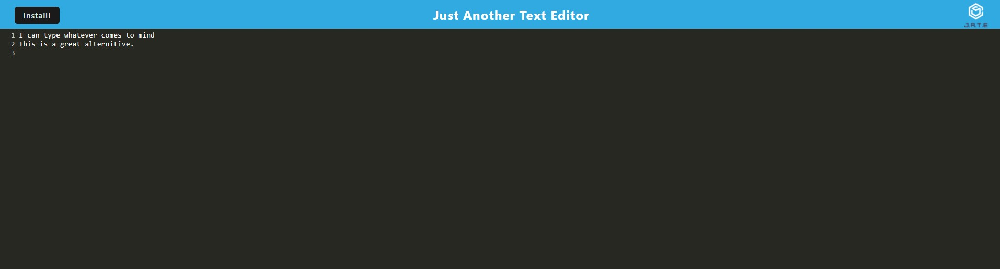

# free-text-editor-app

## Table of Contents

- [Project Description](#Description)
- [Installation](#Installation)
- [Usage](#Usage)
- [GitHub](#GitHub)
- [Contact Me](#ContactMe)
- [View My Video](#ViewMyVideo)

## Description

### Motivation for creating this project

I built this platform because I wanted to create a text editor app that people could download on their laptop or computer and use anywhere

### What problem does this solve?

This application will let users type in a free application even if they do not have access to Mircrosoft word or any default notepad application

## Installation

In order to download and use my code, you will have to clone my repo and install express, idb and concurrently. After downloading my code just run "npm install" for a speedy installation.

## Usage

Keep up to date with all of the latest news stories with your friends families and associates. This will allow you to allows be in the "know" in an eventful world.

## Contact Me

See other projects I have created at https://github.com/DouglasRed

Contact me at douglasred63@yahoo.com for any questions you have about my project.

## View My Video

View my video of this project here https://youtu.be/2sLVf8IATpE on youtube. The link is required to view the video.
